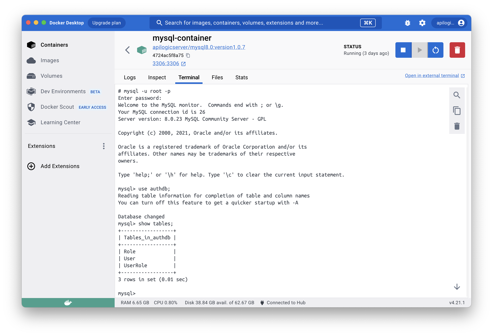
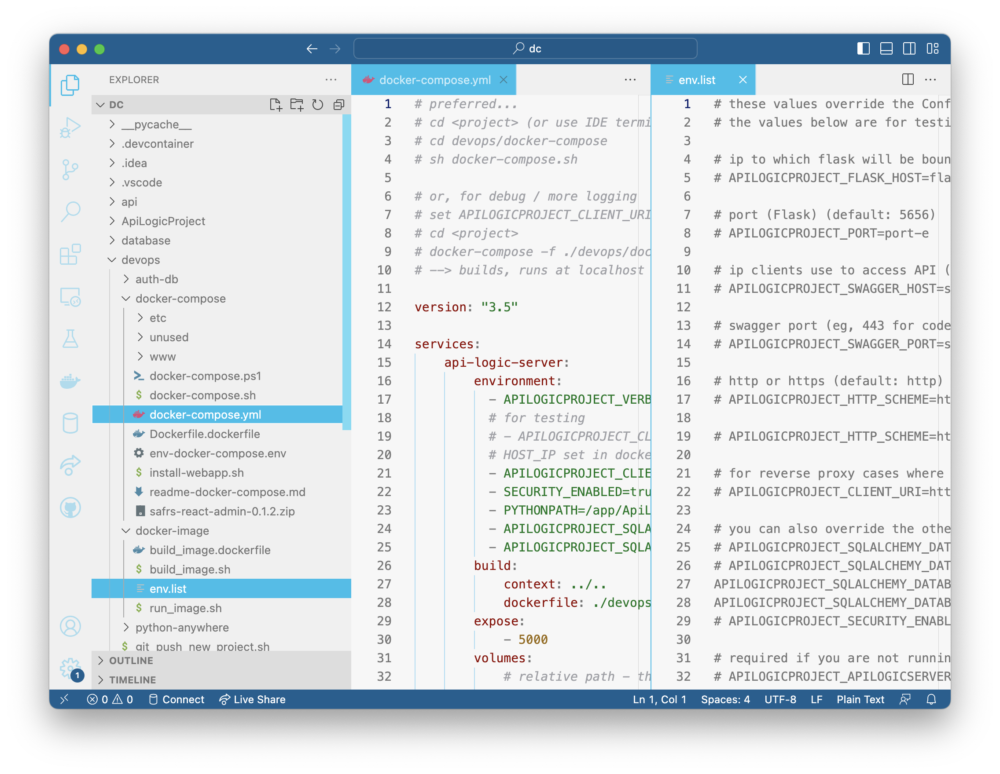

# MySQL ApiLogicProject using Docker and docker-compose

This project illustrates using API Logic Server with Docker and docker-compose.  The objective is to provide a simple way to explore using docker with API Logic Server on your local machine.  These are *not* production procedures - they are designed for simple local machine operation.

This doc explains:

* **I. Creating the project** - create the project from a docker database and run under the IDE

* **II. Running the project as an *image*** - create and run an image

* **III. Running the project as a *docker-compose*** - build, deploy and run

* **IV. Status, Open Issues (eg, not working on windows)** 

This presumes you have Python, and docker.

&nbsp;

&nbsp;

# General Setup

Stop the docker-compose container, if it is running.

&nbsp;

## 1. Install API Logic Server

Install the current (or [preview](https://apilogicserver.github.io/Docs/#preview-version)) release.  Use the `ApiLogicServer` command to verify the version > 9.1.33.

&nbsp;

## 2. Install this project from git

Follow this procedure to obtain the *empty* project from git:

```
# git clone https://github.com/ApiLogicServer/docker-compose-mysql-classicmodels.git
# cd docker-compose-mysql-classicmodels
```

Open the project in your IDE, and estabish your `venv` virtual environment.

&nbsp;

&nbsp;

# I. Create the Project

Follow the steps below:

&nbsp;

## 1. Start the MySQL database container:

```bash
docker run --name mysql-container --net dev-network -p 3306:3306 -d -e MYSQL_ROOT_PASSWORD=p apilogicserver/mysql8.0:latest

```

Verify it looks like this:



&nbsp;

## 2. Create the Project:

Create the project with API Logic Server:

```bash
ApiLogicServer create --project_name=. --db_url=mysql+pymysql://root:p@localhost:3306/classicmodels
```

&nbsp;

## 3. Verify proper operation

The project should be ready to run without customization:

1. Open the project in VSCode



2. Establish your (possibly preview) virtual environment

3. Press F5 to run the server

4. Run the [Admin App](http://localhost:5656), and Swagger.  Verify that `customers` returns data.

&nbsp;

## 4. Add Security - using the terminal window inside VSCode:

**Stop the server.**

Open a ***new* terminal window** in VSCode:

> The *current* terminal window has an old copy of the project root.  If you try to run, you will see *No such file or directory".  Just open another terminal window and repeat the command.

```bash
ApiLogicServer add-auth --project_name=. --db_url=mysql+pymysql://root:p@localhost:3306/authdb
```
Re-run the project (F5), observe you need to login (***admin, p***).

&nbsp;

&nbsp;

# II. Running the git project as image

First, stop the server.

&nbsp;

## 1. Build the Image

> For preview versions, verify `devops/docker-image/build_image.dockerfile` is using `apilogicserver/api_logic_server_x` (note the *_x*).

&nbsp;

```bash
sh devops/docker-image/build_image.sh .
```

&nbsp;

## 2. Observe the pre-configured server

When run from a container, the database uri using `localhost` (from above) does not work.  Confirm the following in [`devops/docker-image/env.list`](devops/docker-image/env.list):

```
APILOGICPROJECT_SQLALCHEMY_DATABASE_URI=mysql+pymysql://root:p@mysql-container:3306/classicmodels
APILOGICPROJECT_SQLALCHEMY_DATABASE_URI_AUTHENTICATION=mysql+pymysql://root:p@mysql-container:3306/authdb
```

&nbsp;

## 3. Start the Server

Use the pre-created command line script:

```bash
sh devops/docker-image/run_image.sh
```

&nbsp;

## 4. Run the App

Run the [Admin App](http://localhost:5656), and Swagger.

You can also run the [Authentication Administration App](http://localhost:5656/admin/authentication_admin/) to define users and roles (though not required).

&nbsp;

&nbsp;

# III. Running the git project as docker-compose

This procedure build the image dynamically.

Alternatively, you can edit the `devops/docker-compose/docker-compose.yml` file to use the image built in the prior step.

&nbsp;

## 1. Stop the server and docker database

Press ctl-C to stop the API Logic Project container.

The procedure below will spin up *another* database container.  If the current database container is running, you will see port conflicts.

**Stop** the database container (e.g., using Docker Desktop).

&nbsp;

## 2. Obtain the web app

The git project does not store these files, so you must obtain them:

```bash
sh install-webapp.sh
popd
```

&nbsp;

## 3. Observe the pre-configured database service

Open [`devops/docker-image/docker-compose.yml`](./devops/docker-compose/docker-compose.yml), and observe:

```yaml
    mysql-service:
        image: apilogicserver/mysql8.0:latest
        restart: always
        environment:
            # MYSQL_DATABASE: 'db'
            # So you don't have to use root, but you can if you like
            - MYSQL_USER=root
            # You can use whatever password you like
            - MYSQL_PASSWORD=p
            # Password for root access
            - MYSQL_ROOT_PASSWORD=p
        ports:
            # <Port exposed> : <MySQL Port running inside container>
            - '3306:3306'
        expose:
            # Opens port 3306 on the container
            - '3306'
```

&nbsp;

## 4. Build, Deploy and Run

The following will build, deploy and start the container stack locally:

```
# sh docker-compose.sh     # windows: .\docker-compose.ps
```

Then, in your browser, open [`localhost`](http://localhost).

&nbsp;

### Manual Port configuration (not required)

The shell script above simply obtains your IP address, and stores in in an env file for server.

Alternatively, you can enter your port into [`devops/docker-image/env-docker-compose.env`](./devops/env-docker-compose.env).

Then, use the following to build, deploy and start the default container stack locally:

```
# cd docker-compose-mysql-classicmodels  # <project-root>
# docker-compose -f ./devops/docker-compose/docker-compose.yml --env-file ./devops/docker-compose/env-docker-compose.env up
```

Then, in your browser, open [`localhost`](http://localhost).

&nbsp;

## 4. Observe Pre-configured Security

The database contains `authdb`.  To activate security, observe [`devops/docker-compose/docker-compose.yml`](devops/docker-compose/docker-compose.yml):

1. Set `- SECURITY_ENABLED=true`

2. Under api-logic-server-environment, observe:

`          - APILOGICPROJECT_SQLALCHEMY_DATABASE_URI_AUTHENTICATION=mysql+pymysql://root:p@mysql-service:3306/authdb
`

&nbsp;
&nbsp;

# Status

Works with API Logic Server > 9.1.33.

